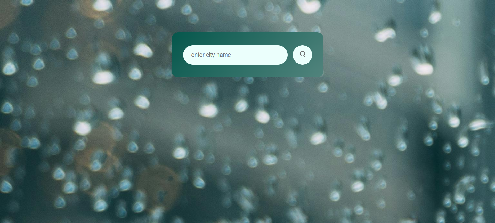
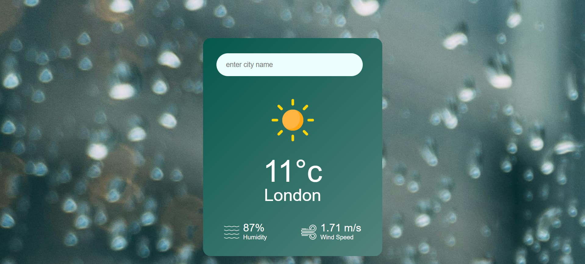

# Weather-App 🌤️

 

A simple weather application built using **HTML**, **CSS**, and **JavaScript**, integrating the [OpenWeatherMap API](https://openweathermap.org/) for fetching real-time weather data.

---

## Features
- 🌍 **City Search**: Search for any city to view its weather data.
- 🌡️ **Temperature**: Displays the temperature in Celsius.
- 💧 **Humidity**: Shows the humidity percentage.
- 💨 **Wind Speed**: Provides wind speed in meters per second.
- 🚫 **Error Handling**: Displays an error message for invalid or incorrect city names.

---

## Technologies Used
- **HTML5**: For structure
- **CSS3**: For styling and responsiveness
- **JavaScript**: For interactivity
